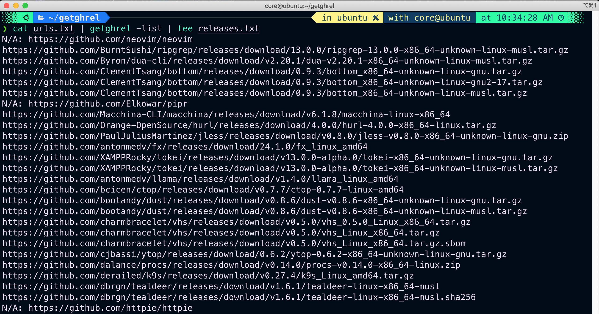
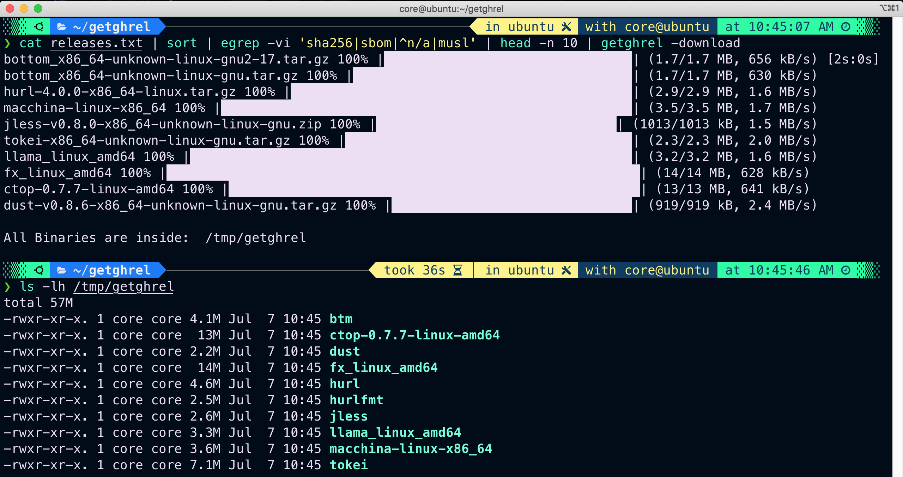

# getghrel

getghrel" is a command-line interface (CLI) tool that locates and downloads the most recent release assets from Github for MacOS and Linux architectures, specifically "amd64" and "arm64". The tool automatically identifies your operating system and architecture, and downloads the binary. If the release is compressed or in an archive format, it will automatically extract and unpack it, no matter how it's compressed, and keep only the binary.

## Installation

Download the latest binary from the [releases](https://github.com/kavishgr/getghrel/releases) section and place it in your `$PATH`. 

### Dependencies

- A GitHub token. By default, the tool will search for the `GITHUB_TOKEN` environment variable. Alternatively, you can also provide one directly on the command line.

## Usage

```sh
getghrel -h
```

All the supported flags:

```sh
-list    list all the releases found
            Will print the latest release for your OS and Architecture.

-con     <int> set the concurrency level (default: 2)

-ghtoken <string> provide a GITHUB TOKEN
            Default is the GITHUB_TOKEN environment variable.
            Example: cat urls.txt | getghrel -list -ghtoken 'YOUR TOKEN' | sort

-download will download and extract the binary inside tempdir(`/tmp/getghrel`)
            Example: cat urls_from_list_results.txt | getghrel -download 

-tempdir <string> specify a a temporary directory to download/extract the binaries
            Default is `/tmp/getghrel`
            Example: cat urls_from_list_results.txt | getghrel -download -tempdir /tmp/test

```

### List Found Releases

To list the found releases, create a text file with a **complete URL** or **owner/repo** per line, and run:

```sh
# List of URLs
# e.g 
cat testurls.txt | getghrel -list -con 3 | sort | tee releases.txt

# Single one
echo "sharkdp/bat" | getghrel -list | sort
```

#### Demo Screenshot




This will display a list of URLs representing the latest release assets found for each repository, along with any other relevant files (such as checksums and SBOMs) specific to your operating system and architecture. 

You can filter the output to remove the checksums and SBOM files before passing it to the `-download` flag to ensure a clean download in the output. However, even if you don't filter the output, the tool will automatically retain only the binaries and remove all unnecessary files. Just filter them out to save some bandwidth. 

`N/A` means the repo doesn't have release assets. Some linux releases will have both gnu and musl releases. Filter them out according to your liking. 

Duplicates are unlikely, but if they do occur, you can easily filter them out using tools like `sort` and `uniq`. That should do the trick.

In case a repository lacks a latest release tag, the tool will search for the most recent release tag instead. In rare cases this can be an unstable/nightly release.

### Download Found Assets

To download the found assets and keep the binaries in a temporary folder (which is `/tmp/getghrel` by default), simply use the '-download' flag:

```sh
# List of URLS found with -list
cat releases.txt | getghrel -download
cat releases.txt | getghrel -download -con 3

# Single one
echo "https://github.com/sharkdp/bat" | getghrel -list | getghrel -download
```

#### Demo Screenshot




As you can see, the bottom package had two releases for weird reasons, and the tool only kept a single.


To download to a different location, use the `-tempdir` flag :

```sh
# List of URLS
cat releases.txt | getghrel -download -tempdir '/tmp/tempbin'

# Single one
echo "https://github.com/sharkdp/bat" | getghrel -list | getghrel -download -tempdir '/tmp/tempbin'
```

## TODO

Add a flag to control the search for recent release tags. With this flag, you can to include the most recent nightly/unstable releases or one below them in `-list`, or skip them altogether. 

## Contributing

If you would like to contribute to getghrel, feel free to fork the repository and submit a pull request. You can also open an issue on the Github repository to report a bug or suggest a feature.
