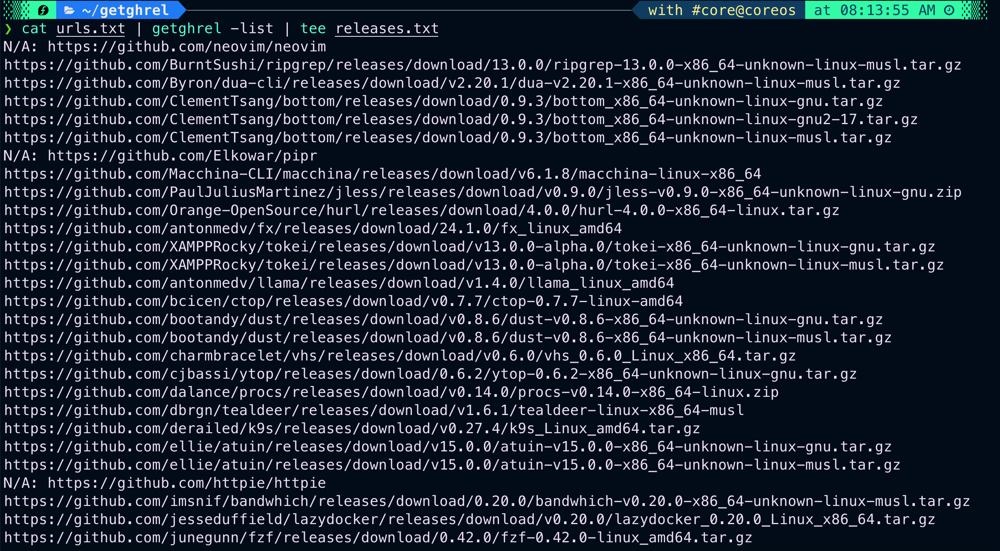

# getghrel

getghrel" is a command-line interface (CLI) tool that locates and downloads the most recent release assets from Github for MacOS and Linux architectures, specifically "amd64" and "arm64". The tool automatically identifies your operating system and architecture, and downloads the binary. If the release is compressed or in an archive format, it will automatically extract and unpack it, no matter how it's compressed, and keep only the binary.

You can also choose to skip the extraction and keep the archive itself if the release is a binary or script that needs dependencies available in the archive.

## Installation

Download the latest binary from the [releases](https://github.com/kavishgr/getghrel/releases) section and place it in your `$PATH`. 

https://github.com/kavishgr/getghrel/releases

### Dependencies

- A GitHub token. By default, the tool will look for the `GITHUB_TOKEN` environment variable. Alternatively, you can also provide one directly on the command line.

## Usage

```sh
getghrel -h
```

All the supported flags:

```sh
-list    list all the releases found
            Will print the latest release for your OS and Architecture.

-con     <int> set the concurrency level (default: 2)

-ghtoken <string> provide a GITHUB TOKEN
            Default is the GITHUB_TOKEN environment variable.
            Example: cat urls.txt | getghrel -list -ghtoken 'YOUR TOKEN' | sort

-download will download and extract the binary inside `/tmp/getghrel`
            Example: cat urls_from_list_results.txt | getghrel -download 

-skipextraction skip the extraction process
	 Example: echo "helix-editor/helix" | getghrel -list | getghrel -download -skipextraction

-tempdir <string> specify a a temporary directory to download/extract the binaries
            Default is `/tmp/getghrel`
            Example: cat urls_from_list_results.txt | getghrel -download -tempdir /tmp/test

-version display version
```

### List Found Releases

To list the found releases, create a text file with a **complete URL** or **owner/repo** per line, and run:

```sh
# List of URLs
# e.g "sharkdp/bat" or https://github.com/sharkdp/bat

cat urls.txt | getghrel -list -con 3 | tee releases.txt

# Single one
echo "sharkdp/bat" | getghrel -list | sort
```

#### Demo Screenshot




This will display a list of URLs representing the latest release assets found for each repository.

In rare cases, you may come across additional files like checksums and SBOMs that are specific to your operating system and architecture. I have taken care to exclude them in the regular expression. However, if any such files exist, you can simply filter them out before using the `-download` flag to ensure a clean download. But don't worry, even if you don't filter the output, the tool will automatically keep only the binaries and remove any unnecessary files. Filtering them out can help save bandwidth.

In the case of `N/A`(not available), it means that the repository doesn't have any release assets available. For Linux releases, there might be separate versions for both Gnu and Musl. You can choose to filter them out based on your preferences.

> Note: In the example above, the first line shows that the 'neovim' package is unavailable. But neovim does have a latest release. The reason it's not listed is because my regex always checks for assets containing both the OS and architecture, while neovim's assets only specify the OS. There are ways to resolve this issue, but it involves dealing with regex, which can be a bit complex. Nevertheless, you can be confident that every release will be discoverable, except for this particular case.

Duplicates are unlikely, but if they do occur, you can easily filter them out using tools like `sort` and `uniq`. That should do the trick.

In case a repository lacks a latest release tag, the tool will search for the most recent release tag instead. In rare cases this can be an unstable/nightly release.

### Download Found Assets

To download the found assets and keep the binaries in a temporary folder (which is `/tmp/getghrel` by default), simply use the `-download` flag:

```sh
# List of URLS found with -list
cat releases.txt | getghrel -download
cat releases.txt | getghrel -download -con 3

# Single one
echo "https://github.com/sharkdp/bat" | getghrel -list | getghrel -download
```

Before using `-download`, remove any lines starting with 'N/A' from the list of found assets, like shown below.

#### Demo Screenshot


In the example above, you can observe that the `ClementTsang/bottom` package had two releases due to different versions of GNU. However, the tool only retained one version. You can filter out these additional releases. I included them here for the purpose of this example.

To download to a different location, use the `-tempdir` flag :

```sh
# List of URLS
cat releases.txt | getghrel -download -tempdir '/tmp/tempbin'

# Single one
echo "https://github.com/sharkdp/bat" | getghrel -list | getghrel -download -tempdir '/tmp/tempbin'
```

### Skip Extraction

To keep the file unarchived or uncompressed, you can simply use the `-skipextraction` option:

```sh
echo "helix-editor/helix" | getghrel -list | getghrel -skipextraction -download
```

It is useful for releases that require dependencies bundled together in separate files or folders, rather than just a single binary.

#### Demo Screenshot


## TODO

- Add an option to control the search for recent release tags. With this flag, you can choose to include the most recent nightly/unstable releases or one below them with `-list`, or skip them altogether. 

- Add an option to include appimages.

- **Optional**: update the regex or add some sort of backup/rescue regex to include releases that contain only the operating system and not the architecture. Most releases do include both the OS and architecture, I'm mentioning it here because of the neovim issue discussed earlier.

## Contributing

If you would like to contribute to getghrel, feel free to fork the repository and submit a pull request. You can also open an issue on the Github repository to report a bug or suggest a feature.